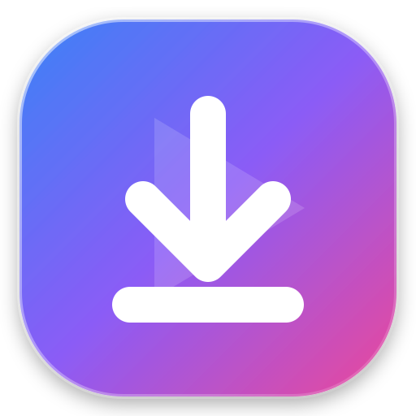

# 🎬 Medya İndirici & Önizleyici (Media Downloader & Player)

<div align="center">
  
  <br />
  <h3>🌐 YouTube, Sosyal Medya, Video ve Görsel İndirici Web Uygulaması</h3>
  <p><strong>Geliştirici:</strong> Ahmet Gün</p>

  [](https://app.netlify.com/drop)
  [](https://developer.mozilla.org/en-US/docs/Web/HTML)
  [](https://developer.mozilla.org/en-US/docs/Web/CSS)
  [](https://developer.mozilla.org/en-US/docs/Web/JavaScript)
  [](https://www.python.org/)
</div>

---

## 📖 Proje Hakkında

**Medya İndirici & Önizleyici**, kullanıcıların internetteki doğrudan medya bağlantılarını (JPG, PNG, GIF, WebP, MP4, WebM vb.) veya popüler platform bağlantılarını (**YouTube, TikTok, Twitter/X, Instagram**) yapıştırarak anında önizleyebileceği, çözünürlük/format seçebileceği ve tek tıkla cihazına indirebileceği modern bir web uygulamasıdır.

Tasarım tamamen **mobil uyumlu (responsive)** olup masaüstü, tablet ve cep telefonlarında akıcı bir kullanıcı deneyimi sunar.

---

## ✨ Öne Çıkan Özellikler

- **🎥 YouTube & Sosyal Medya İndirme:**
  - YouTube videolarını otomatik analiz eder ve video başlığı, süresi ve kanal bilgisini gösterir.
  - **🎬 En Yüksek Kalite Video (HD/4K MP4)** seçeneği (Görüntü ve Ses tam birleştirilmiş).
  - **🎵 Sadece Müzik / Ses (MP3)** formatında kaydetme seçeneği.
- **🖼️ Doğrudan Görsel & Video Desteği:**
  - JPG, PNG, GIF, WebP, SVG formatlarında doğrudan görsel önizleme ve çözünürlük ölçümü.
  - MP4, WebM, OGG videolarını dahili oynatıcı ile tarayıcıda takılmadan oynatma.
- **📱 %100 Mobil & Dokunmatik Uyumlu:**
  - Akıllı telefonlarda mükemmel çalışan responsive tasarım, dokunmatik butonlar ve modern Glassmorphism arayüzü.
- **📋 Hızlı İşlem Araçları:**
  - Panodan tek tıkla yapıştırma (`Paste`) butonu.
  - İndirmeden önce dosya adını özelleştirme imkanı.
  - Hızlı test için tek tıkla çalışan örnek video, görsel ve GIF butonları.
- **⚡ Dahili FFmpeg Desteği:**
  - Arka planda çalışan Python sunucusu, yüksek kaliteli video ve ses akışlarını FFmpeg ile kayıpsız birleştirir.

---

## 📂 Proje Dosya Yapısı

```
link_ile_video_indirme/
├── index.html       # Modern ve mobil uyumlu ana arayüz
├── style.css        # Glassmorphism, karanlık tema ve responsive stiller
├── app.js           # İstemci taraflı medya analizi, önizleme ve indirme mantığı
├── server.py        # Python Flask + yt-dlp + FFmpeg yerel medya motoru
├── favicon.svg      # Özel tasarım yüksek çözünürlüklü SVG logo ve favicon
├── netlify.toml     # Netlify canlı yayın yapılandırması
├── _redirects       # Netlify yönlendirme kuralları
├── .gitignore       # Git için gereksiz geçici dosyaları hariç tutma ayarı
└── README.md        # Detaylı proje dokümantasyonu
```

---

## 🚀 Kurulum ve Çalıştırma

### 1. Yerel Bilgisayarda Çalıştırma (En Yüksek Performans)

Projeyi kendi bilgisayarınızda tüm özellikleriyle (YouTube MP4/MP3 indirme ve FFmpeg dönüştürme) çalıştırmak için:

```bash
# Gerekli kütüphaneleri yükleyin (yalnızca ilk seferde):
pip install yt-dlp flask flask-cors imageio-ffmpeg

# Sunucuyu başlatın:
python server.py
```

Sunucu başladıktan sonra tarayıcınızdan **[http://localhost:5500](http://localhost:5500)** adresine gidin.

---

## 🌐 Netlify Üzerinden Canlıya Alma (Arkadaşlarınızla Paylaşın)

Uygulamanızı internette ücretsiz olarak yayınlayıp arkadaşlarınıza link olarak göndermek için:

### Yöntem: GitHub ile Otomatik Netlify Bağlantısı (Önerilen)
1. **[Netlify](https://app.netlify.com)** hesabınıza giriş yapın.
2. **"Add new site" > "Import an existing project"** butonuna tıklayın.
3. **GitHub** sağlayıcısını seçin ve **`Ahmet003-cod/link_ile_video_indirme`** reponuzu seçin.
4. **"Deploy site"** butonuna tıklayın.
5. Siteniz saniyeler içinde `https://ahmetgun-medya.netlify.app` gibi bir bağlantıyla dünya genelinde yayına girecektir!

---

## 👨‍💻 Geliştirici

Bu proje **Ahmet Gün** tarafından tasarlanmış ve geliştirilmiştir.

- **GitHub:** [@Ahmet003-cod](https://github.com/Ahmet003-cod)
- **Repo:** [Ahmet003-cod/link_ile_video_indirme](https://github.com/Ahmet003-cod/link_ile_video_indirme)

---

## 📄 Lisans

Bu proje MIT lisansı altında serbestçe kullanılabilir ve geliştirilebilir.
